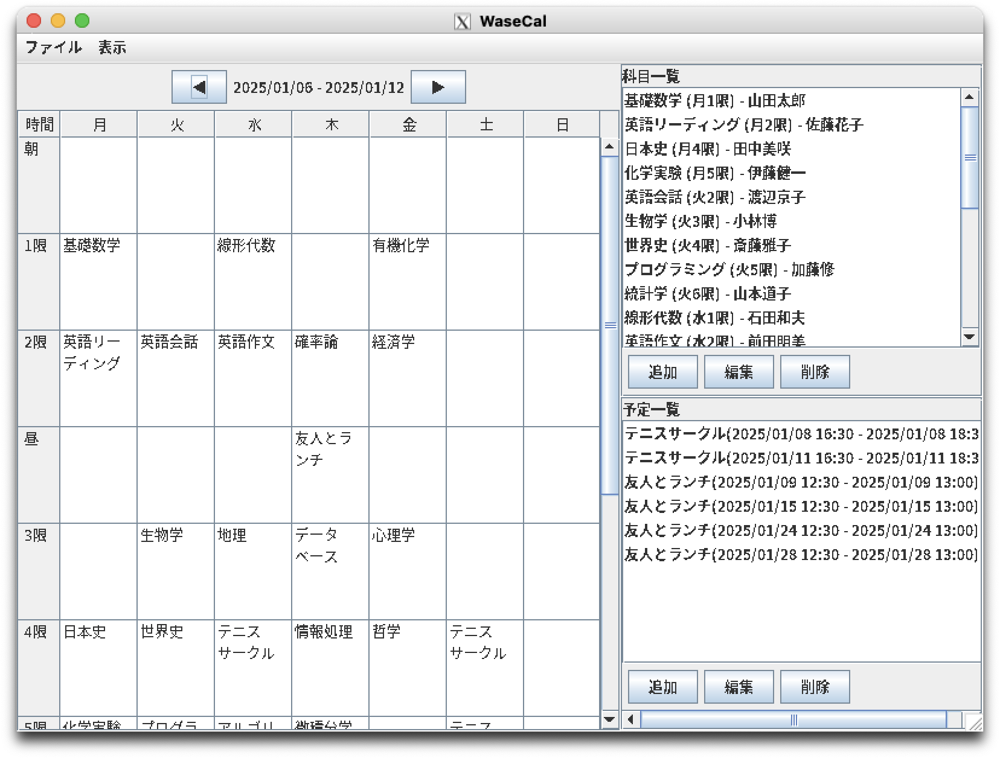
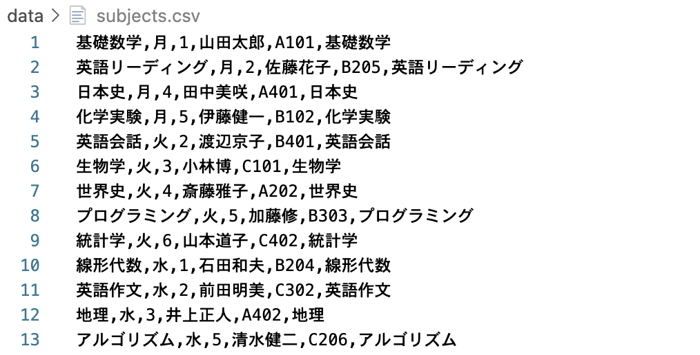
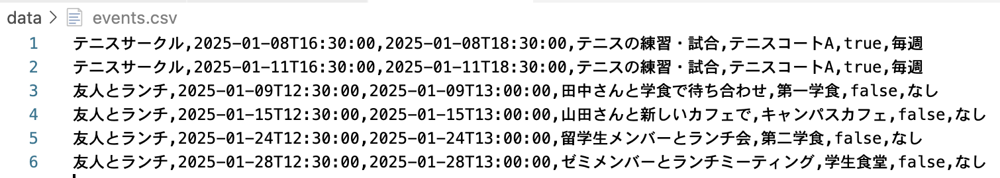
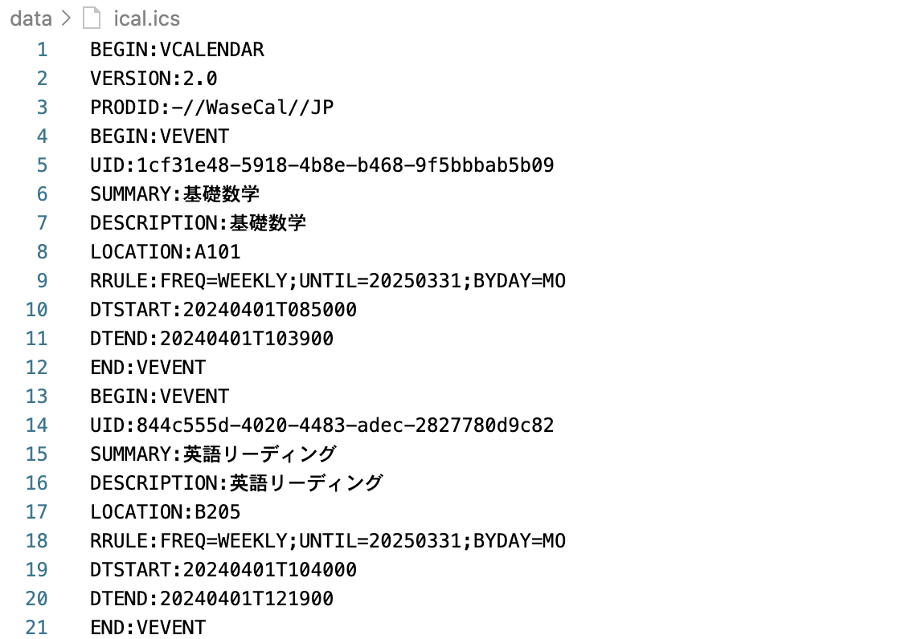
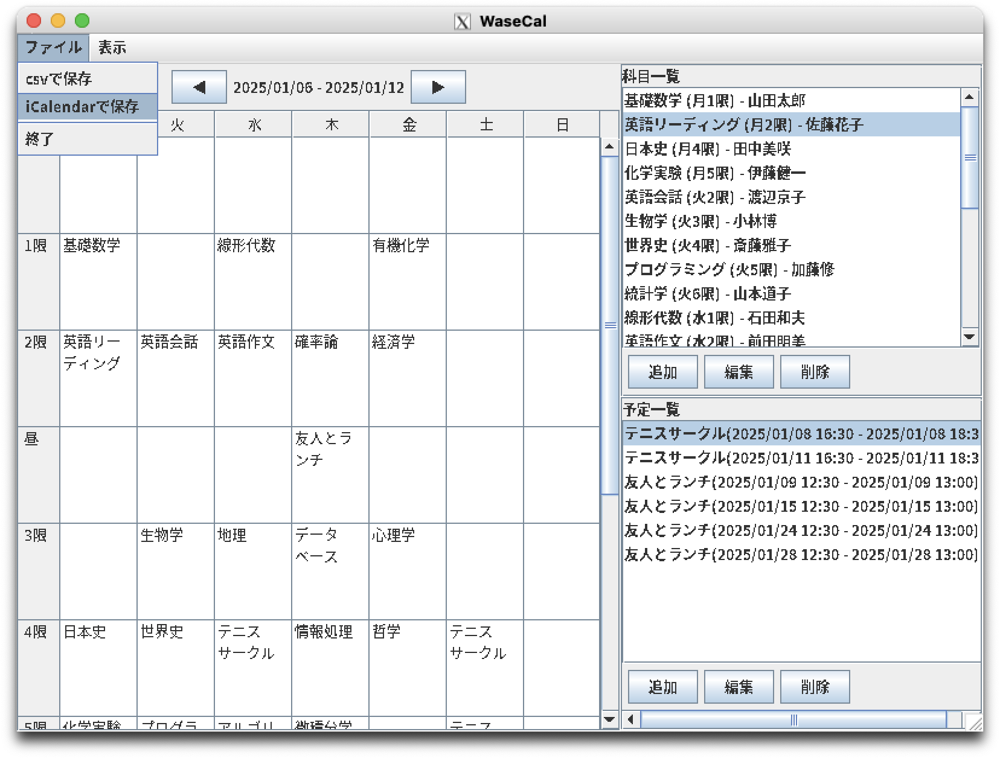
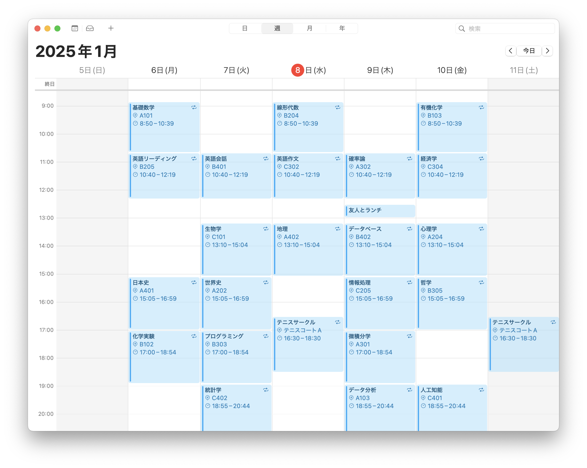

# Wasecal
早稲田大学の学生向けのカレンダーアプリ。


## インストール & 実行
- 配布ファイルを使用する場合
  1. 配布されたzipファイルをダウンロード、展開。
  2. プロジェクトディレクトリ(wasecal)に移動、コンパイル。
      ```
      cd wasecal
      javac -d bin -sourcepath src src/Main.java
      ```
  3. 実行
      ```
      java -cp bin Main
      ```

- ソースコードをダウンロードする場合
  1. リポジトリからコードをクローン
      ```
      git clone <<RepositoryURL>>
      ```
  2. プロジェクトディレクトリ(wasecal)に移動、コンパイル
      ```
      cd wasecal
      javac -d bin -sourcepath src src/Main.java
      ```
  3. 実行
      ```
      java -cp bin Main
      ```

## ファイルの保存/読み込み
授業や予定のデータを、csvファイルやiCalendarファイルとして保存することができます。また、それらのファイルを読み込むこともできます。

### ファイルの保存形式
- csvファイル
  - subjects.csv
    - 科目名, 曜日, 時限, 担当教員, 教室, 説明
    - 
  - events.csv
    - イベント名, 開始日時, 終了日時, 説明, 場所, 繰り返し, 繰り返しの周期
    - 
- iCalendarファイル
  - 

### ファイルの読み込み
dataディレクトリにファイルを配置した状態で起動すると、自動でファイルを読み込みます。
csvファイルがある場合にはcsvファイルを読み込み、csvファイルがなくiCalendarファイルがある場合にはiCalendarファイルを読み込みます。
対応しているファイルの形式については、ファイルの保存形式の項目を参照してください。

### ファイルの保存
ファイルタブから保存形式を選択してください。
データはdataディレクトリに保存されます。


iCalendarファイルは、一般的なカレンダーアプリで読み込めます。
以下はApple Calendarで読み込んだ例です。
